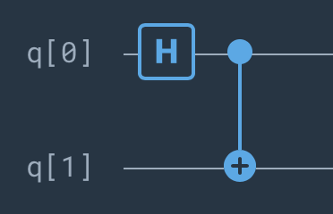
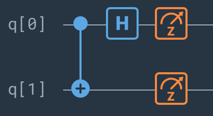

# QuTech Challenges @ MIT iQuHACK 2022

  
  

## Description 

For the 2022 edition of the iQuHack (interdisciplinary Quantum HACKathon), [QuTech](https://qutech.nl) has partnered with the team at MIT to propose 2 challenges, hosted in our own multi-hardware Quantum Technology platform, [Quantum Inspire](https://www.quantum-inspire.com). These aim to draw participants to the challenges at the heart of our mission: to develop scalable prototypes of a quantum computer and an inherently safe quantum internet, based on the fundamental laws of quantum mechanics.

To qualify for the QuTech Division Challenge, participants should submit a project that addresses either the proposed Quantum Error Correction (QEC) challenge or the Quantum Key Distribution (QKD) challenge. Detailed descriptions of these two challenges and their goals are available in the documents linked below (hosted in this repository):

- [Quantum Error Correction Challenge](https://github.com/iQuHACK/2022_qutech_challenge/blob/main/QuantumErrorCorrectionChallenge.pdf)

# Our Project

## Superdense Coding
Superdense Coding is a protocol that allows a messenger to send two classical bits of information by transferring only one qubit. 
This can be thought of as the flipside of quantum teleportation, which allows the sender to transfer the state of their qubit to the receiver by sending two classical bits of information. Superdense coding assumes that the sender and receiver share two qubits that are entangled with each other.

Let's say Alice wants to send two classical bits of information to Bob. There are four possible messages she can send: `00`, `01`, `10`, or `11`. Alice has one qubit, and Bob has another.

To start, the two of them meet up and entangle their qubits. This can be achieved by the following circuit:

                    
Next, Alice and Bob travel to different locations (their qubits are assumed to mainain an entangled state).

Alice can modify the Bell state by applying an X gate, a Z gate, or both. She can use these gates to encode the message she wants to send to Bob.

Once she does this, she sends her qubit to Bob. Bob performs a measurement in the Bell basis by executing the following circuit:

The resulting output is the two-bit message that Alice was trying to send. Run the jupyter notebook to try it out!

### Error mitigation method

We used a calibration method to reduce the effect of gate errors with the provided by the module Qiskit Ignis (deprecated). The method consists in getting the raw data in the form of a vector V and getting a calibration matrix A from it. essentially the solution to the problem:

 
We compute the calibration matrix on the device where we did the implementation and then use it to mitigate the measurement errors caused by the noisy nature of today's quantum hardware.

---
- for details about the implementation refer to Superdense Coding.ipynb

Defining a Metric for Error Correction Codes
There are numerous approaches to determining how robust an error correcting code is. The easiest place to start is with the ratio of encoded qubits to physical qubits. More effiecient codes requiring fewer physical qubits for each encoded qubit are preferred. In the case of repetition code, $|\bar{0}> =|000>$ and $|\bar{1}> = |111>$, we require 3 physical qubits for each encoded qubit. The second aspect to take into consideration is how many errors are required to map one encoded qubit to another; we call this the distance. Again considering the repetition code if we have one bit flip we can use majority vote and still have the correct encoded qubit. Thus, it takes two bit flips errors to map an encoded qubit to another. However, a single phase error, Pauli z, takes the encoded qubit $|\bar{\text{+}}> = \frac{1}{\sqrt{2}}(|111> + |000>)$ to the encoded qubit $|\bar{\text{-}}> = \frac{1}{\sqrt{2}}(|111> - |000>)$. Thus, the minimum number of errors required to map one encoded qubit to another is 1: $distance=1$. 
Since quantum computers have different probabilities for different errors, we must take into account both the distance and the probability of the specific error. What we are interested in is the product of the distance and the probability of a specific error occurring, we define this this product to be total distance. We define our metric to be \begin{equation} M = \text{total distance}\frac{\text{encoded qubits}}{\text{physical qubits}} \end{equation}

## Summary of MIT IQuHack 2022
We learned a lot about error correction and had a lot of fun getting to know each other. However, we found that error correction is very difficult and were unable to develop a working error correction code. Overall, it was a good learning experience and we look forward to competing next year!

